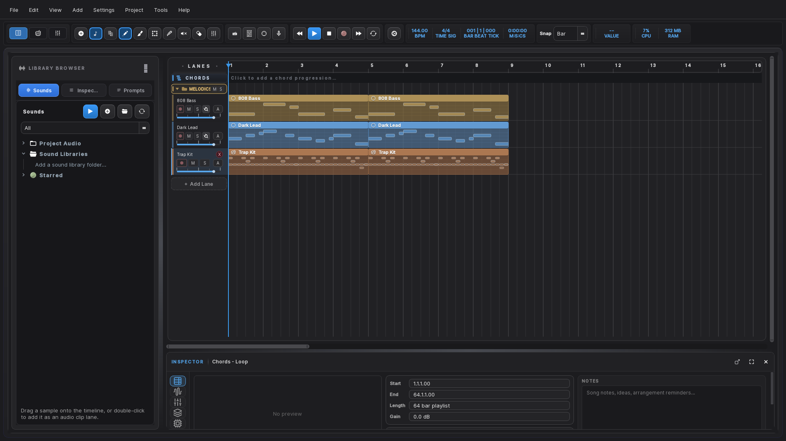
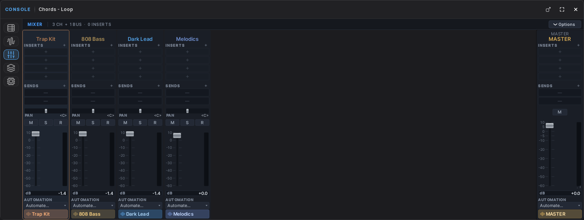
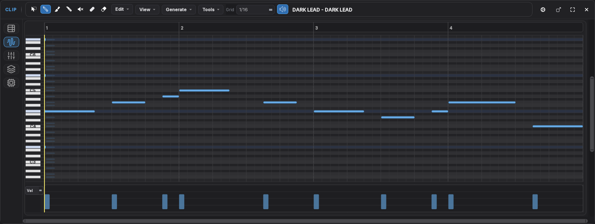
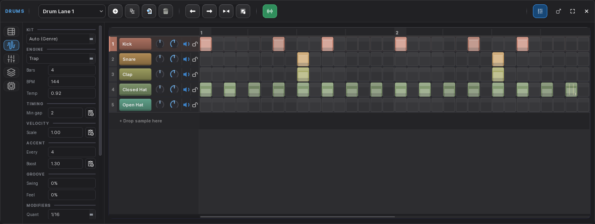

# MuseLab Studio

A complete music production studio for Windows — arrangement, mixing, plugins, and AI-assisted
composition in one application.

**Free to use.** No account, no subscription, no cloud. Everything runs on your machine.

---

## Download

**[Download MuseLab Studio for Windows](https://github.com/jaylex32/muselab-studio/releases/latest)**

Windows 10 or 11, 64-bit. The installer is around 2.8 GB because the AI models ship with it — there
is nothing to download afterwards and nothing to sign up for.

> On first launch Windows may show a SmartScreen warning because the installer is not code-signed
> yet. Click **More info → Run anyway**.

---

## What it does

### Arrangement
A full timeline with audio, MIDI, and drum lanes. Clips repeat when you stretch them, lanes can be
grouped into folders, and every folder gets its own fader so you can ride a whole group without
touching the balance inside it.

### Mixing

Per-channel inserts, sends, buses, pan and automation, with a master chain. Group buses are real
signal routing, not a macro over other faders.

### Piano roll

Draw, edit, quantise, and transpose. Velocity editing underneath, scale locking, and chord tools.

### Drums

Step sequencer with per-step velocity, rolls, nudge, probability, and conditional triggers. Swap the
kit or any individual sample.

### Plugins
VST3 and LV2 instruments and effects, scanned and hosted out of process so a bad plugin cannot take
the app down with it.

### AI tools, all running locally
- **Text-to-audio** — describe a sound and generate it
- **Stem separation** — split a mix into vocals, drums, bass, and other
- **Audio to MIDI** — turn a recording into editable notes
- **Drum generation** — a trained model that writes patterns in 31 genres
- **Assistant** — a built-in language model that answers questions about your project

Nothing is sent anywhere. There is no API key and no account.

---

## Demo project

The release includes a demo project and the audio and MIDI it produced, so you can hear the output
before installing anything:

| File | What it is |
|---|---|
| `trap-kit.wav` | The drum pattern, rendered |
| `808-bass.wav` | The 808 line |
| `dark-lead.wav` | The lead motif |
| `808-bass.mid` / `dark-lead.mid` | The same parts as MIDI, to drop into any DAW |

---

## Requirements

|  | Minimum | Recommended |
|---|---|---|
| OS | Windows 10 64-bit | Windows 11 |
| RAM | 8 GB | 16 GB or more |
| Disk | 6 GB | 10 GB |
| Audio | Any output device | An audio interface with an ASIO driver |
| GPU | Not required | NVIDIA, for much faster stem separation and generation |

The AI features run on the CPU if you have no GPU. They are slower, not unavailable.

---

## Getting started

1. Run the installer and launch MuseLab Studio.
2. Open **Settings → Audio** and pick your output device. If you have an audio interface, choose its
   own ASIO driver rather than a generic one — it is the difference between comfortable latency and
   a constant fight with it.
3. Point the plugin scanner at your VST3 folder if you have plugins.
4. Open the demo project, or start a new one.

---

## Known limitations

Being straight about where it stands:

- **Windows only.** No macOS or Linux build.
- **Not code-signed**, so the first launch shows a SmartScreen warning.
- **This is a first release.** It has been tested heavily, and the packaged app verifies its own
  subsystems on every build, but it has not been through thousands of hours in other people's
  studios yet. Back up work you care about, as you would with any new tool.

---

## Reporting a problem

Open an issue with:

- what you did, what you expected, and what happened
- your Windows version and audio device or driver
- the log from **Help → Open Log Folder**, if the app was running

Specific reports get fixed. "It doesn't work" cannot be.

---

## Licence

Free to use. The source is not published at this time.

MuseLab Studio is not affiliated with Steinberg Media Technologies GmbH. VST is a trademark of
Steinberg Media Technologies GmbH.
